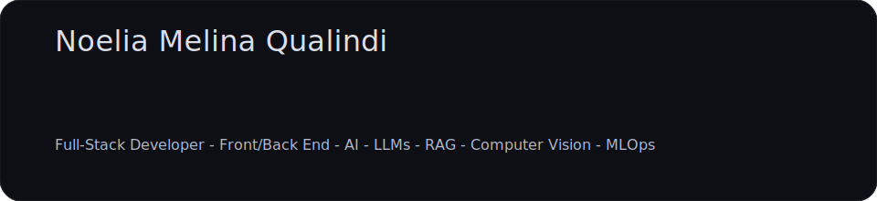

<!-- Profile README for GitHub: noequalindi/noequalindi -->

  

### About me
AI Specialist (UBA) with a Multimedia degree (UNA), pursuing an **M.Sc. in AI (UBA)** and **Systems Engineering (UTN)**. University lecturer since 2018. I work on **AI applications** across **Deep Learning**, **Computer Vision**, **LLMs** **RAG Architectures**, and **Generative AI**. I build **MLOps pipelines** and ship web products with **front end frameworks**. Also an artistic roller skater — I love blending data, art, and sport.

### What I’m doing now
- **Full-stack & AI Developer — SCV Soft** (Jun 2021 – present)  
  Node.js/TypeScript, Angular/React, Ruby on Rails/Vue; PostgreSQL/MongoDB; Python for ML; PyTorch/TensorFlow, Airflow; AWS/GCP; Docker.
- **Lecturer — Universidad Nacional de las Artes (UNA)** (2018 – present)  
  CS & Programming for Multimedia Arts; **research on AI development models applied to multimedia** (Computer Vision/Vision Transformers, Generative pipelines, evaluation, and reproducibility).
- **Applied research**: reliable **RAG/LLMs** (fine tuned & low hallucinations), sensitive news/case classification, and **risk**. Computer vision and Vision Transformer models. 

### Exploring / learning
- Inference optimization & robust evaluation for **RAG/LLMs**.  
- Vision Transformers and generative pipelines (face restoration, SD).  
- Hybrid indexing (BM25 + embeddings) and **reproducible MLOps**.

### Tech

  

### Projects (highlights)
- **Interdisciplinary Assistant for Protective Measures in Gender-Based Violence Case Files via Retrieval-Augmented Generation (RAG) — FIUBA M.Sc. in AI (UBA Engineering) · Ongoing**  Extension of **relevant-information extraction** and **multi-label violence-type classification** with **protective-measures assistance** (recommendations/explanations) using RAG, in collaboration with **IALAB (UBA Social Sciences)** and an interdisciplinary team.  
  **Focus:** RAG pipelines, LLM fine-tuned with alignment for low hallucination, legal NLP, governance & privacy.
  
- **Classification and Prediction of Gender-Based Violence with AI Tools — UBA AI Specialization**  (jun 2025)
  End-to-end pipeline for scraping/anonymization → embeddings and **classification** of news/case files → **relevant-information extraction** (legal signals) → **predictive modeling** (risk scoring and timelines).  
  **Stack:** Python, FastAPI, Airflow, MongoDB, ChromaDB, Hugging Face (SBERT/RoBERTa), PyTorch/TensorFlow, evaluation with Accuracy/F1/AUC.

- **Parallelismus — Mixed Reality immersive experience (UNA - Multimedia | thesis)**  (2019-2020)
  Conceptualization, 3D modeling, and Unity development in C++ and C# of an MR piece that draws an anthropological parallel between Paleolithic technologies (e.g., caves and techniques) and today’s digital media. The installation was designed for two Argentine caves, and then virtual worlds were modeled to extend the experience.

### Experience
- **SCV Soft** — Full-stack & AI Developer · Jun 2021 – present  
  Node/TS, Angular/React, Rails/Vue, Postgres/Mongo, Python/ML, Airflow, AWS/GCP, Docker.
- **Almundo** — Software Engineer · Feb 2020 – Jun 2021  
  Front-end/back-end (Java/Node, Angular.js, Mongo, Docker, CI/CD).
- **web.com** — Software Engineer · Oct 2018 – Feb 2020  
  Front-end and automations.
- **C&S Informática** — QA Automation Tester · Apr 2017 – Oct 2018  
  Automation (Fluentlenium/Jenkins) and front-end (React/Node).

### Education
- **M.Sc. in Artificial Intelligence — UBA** · 2025 – present  
- **Specialization in Artificial Intelligence — UBA** · 2023 – 2025  
- **Systems Engineering — UTN** · 2017 – present  
- **B.A. in Multimedia Arts — UNA** · 2013 – 2020

### Certifications
- Drone/VANT Pilot License (ANAC)  
- AI – Neural Networks (UTN)  
- “Mil Mujeres en IA” (INTEL)  
- Full-stack Developer (UTN)

### Languages
Spanish (native) · English (Upper Intermediate) · French (basic) · Italian (basic)

### Activities
Athlete — **Artistic Roller Skating** (Argentina national team).

### How I can help
- **RAG/LLM** architectures with low hallucinations + anonymization/privacy.  
- **Reproducible MLOps** (data/models) and deployments **AWS/GCP/Docker**.  
- **Front/Back** for data-driven products (React/Next/Angular · FastAPI/Node).  
- **Survival models** for risk and event series.

### Contact
- Linktree: https://linktr.ee/noequalindi  
- Email: noelia.qualindi@gmail.com

---

## Stats

  

  

  

  

